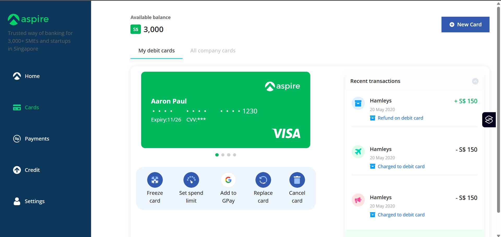
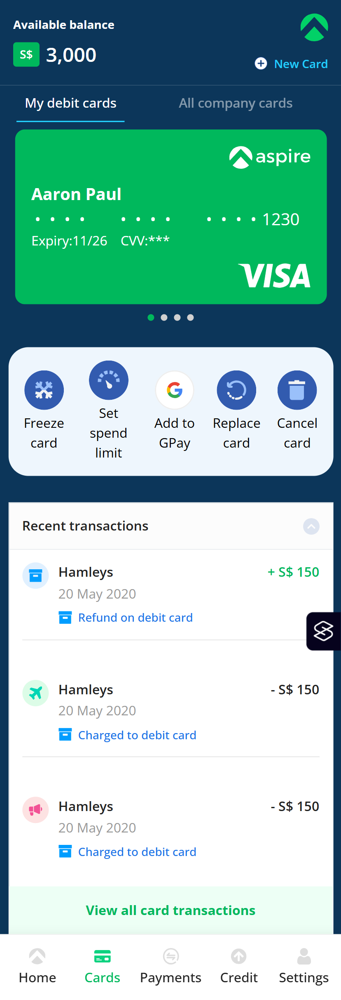
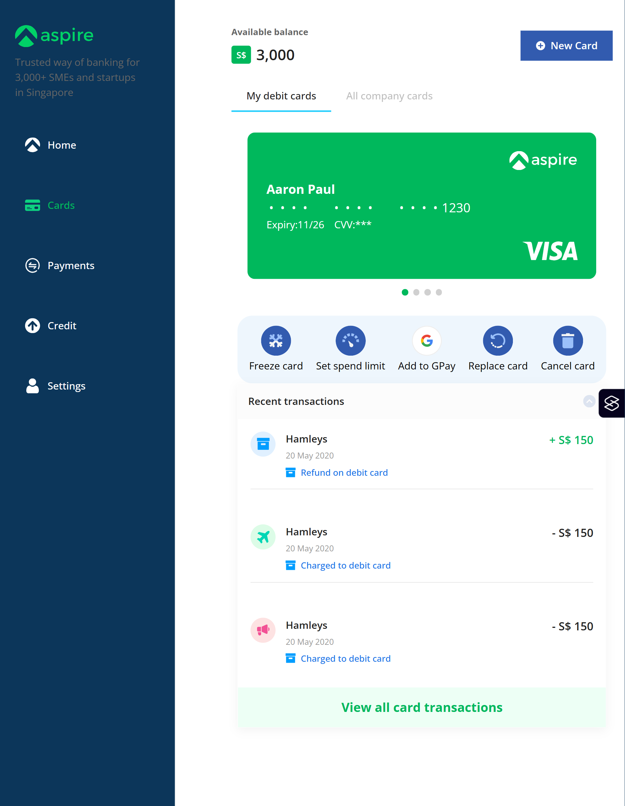

# Aspire Test Solution

[Aspire Test Solution](https://xd.adobe.com/view/80c753f2-db2f-4dfc-b6c2-ce39a4c787f0-d594/specs/)

## Overview

This is a modern aspire application interface built using React and styled with CSS. The project implements a responsive design system that provides a seamless user experience across desktop, tablet, and mobile devices.

Key features:
- Responsive grid layout with adaptive column widths for different screen sizes
- Modern card-based UI design with clean typography
- Interactive components with hover states and transitions
- Custom color scheme and design system using CSS variables
- Semantic HTML structure for better accessibility
- Optimized layout for financial data visualization

### Links

- [Solution](https://github.com/Lokesh8055/aspire-project)
- [LiveSite](https://aspire-project-lp.netlify.app/)

### Screenshot

## My process
I started by analyzing the design requirements and breaking down the UI components into reusable pieces. Here's my development process:

1. Project Setup
- Created React project using Vite
- Set up folder structure for components, styles, and assets
- Configured routing with react-router-dom

2. Design System Implementation
- Defined CSS variables for colors, spacing, typography
- Created base component styles and utility classes
- Implemented responsive breakpoints

3. Component Development
- Built core components (Sidebar, Cards, Transactions)
- Added interactive states and animations
- Implemented responsive layouts

4. Testing & Refinement
- Tested across different screen sizes
- Optimized component reusability
- Refined animations and transitions

5. Deployment
- Built production bundle
- Deployed to Netlify
- Tested live site functionality

### Built with

- React
- CSS custom properties
- Flexbox
- CSS Grid
- Mobile-first workflow
- [React](https://reactjs.org/) - JS library
- [React Router](https://reactrouter.com/) - For navigation
- [Vite](https://vitejs.dev/) - Build tool
- [Netlify](https://www.netlify.com/) - For deployment

### What I learned
Through this project, I gained valuable experience in several areas:

1. Advanced CSS Techniques
- Mastered CSS custom properties for maintainable theming
- Improved understanding of box-shadow effects and transitions
- Deepened knowledge of CSS Grid and Flexbox for complex layouts

2. Responsive Design
- Implemented a mobile-first approach effectively
- Created fluid layouts that adapt across different screen sizes
- Learned to handle complex component arrangements at various breakpoints

3. React Best Practices
- Enhanced component organization and reusability
- Improved state management patterns
- Better understanding of React Router for navigation

4. Performance Optimization
- Learned to optimize component rendering
- Improved asset loading strategies
- Implemented efficient CSS animations

## Author

- LinkedIn - [lokesh](https://www.linkedin.com/in/lokesh-padmanabhan/)
